# OpenBridge 用户手册与 API 文档


本文档说明 OpenBridge 的各项前端功能、常见使用方式和后端 API，并已按章节插入截图；少数不适合展示的步骤以文字说明为主。

适用版本：v1.3

## 目录

1. 产品概览
2. 基础概念
3. 首次启动与登录
4. 页面导航与公共按钮
5. 仪表盘
6. OpenList 文件浏览
7. 下载确认弹窗
8. 下载任务
9. 服务商管理
10. 配额管理
11. Rclone 挂载配置
12. 设置
13. 调试页面
14. WebDAV Mount 用法
15. API 文档
16. 常见问题

## 1. 产品概览

OpenBridge 是一个面向 OpenList 的下载编排控制台。它主要用于：

- 统一查看 OpenList 文件。
- 在 OpenList 文件页执行删除、重命名、复制、剪切和查看详情等基础文件管理操作。
- 管理服务商账号和本地存储。
- 创建 Mount 挂载点并查看真实或虚拟配额。
- 将文件提交到服务端 aria2 下载。
- 对百度等可直链文件生成终端直下链接、二维码或直链清单。
- 管理 rclone 配置并在本机挂载盘符或目录。
- 查看 OpenBridge 所在主机的 CPU、内存、磁盘和带宽状态。


## 2. 基础概念

### 2.1 OpenList Base URL

OpenList Base URL 是 OpenBridge 连接 OpenList 的地址，例如：

```text
http://127.0.0.1:5244
```

切换 OpenList Base URL 后，OpenBridge 会按当前源隔离服务商、Mount、rclone 配置和文件浏览上下文。

### 2.2 用户根目录

OpenBridge 的文件浏览根目录 `/` 对应当前 OpenList 登录用户可见的根目录，不一定是 OpenList 全局根目录。不同 OpenList 用户如果有不同 `base_path`，进入 OpenBridge 后看到的 `/` 也会不同。

### 2.3 Provider 服务商

Provider 表示一个存储后端账号或本地存储入口，例如：

- 通用：通过 OpenList API 路由访问，适用于任意 OpenList 中已有网盘。
- 百度网盘：使用百度 access_token，支持直链解析。
- 夸克网盘：使用 Cookie，支持配额同步。
- 本地存储：使用本机目录，读取真实磁盘容量。

### 2.4 Mount 挂载点

Mount 是 OpenBridge 的容量和 WebDAV 映射单位。一个 Mount 对应 OpenList 中的一个路径，例如 `/movie`、`/onedrive`。

Mount 支持两种主要配额模式：

- 真实：从 Provider 或磁盘读取真实容量。
- 虚拟：手动指定总容量和已用容量。

### 2.5 aria2

aria2 用于服务端下载。通过 OpenBridge 创建的下载任务会被提交到运行 OpenBridge 的那台电脑上的 aria2 RPC。

### 2.6 rclone

rclone 用于把一个或多个 Mount 映射为本地盘符或目录。OpenBridge 可以保存配置、写入 rclone 配置、启动挂载、停止挂载和删除配置。

### 2.7 设备会话

OpenBridge 会为每台浏览器设备生成本地设备 ID，并通过 `X-OpenBridge-Device-ID` 请求头识别设备。同一账号默认最多允许 5 台设备同时登录，管理员可在设置页调整。

## 3. 首次启动与登录

### 3.1 启动程序

在发布包目录中运行：

```powershell
.\openbridge.exe server
```

如果开启了“启动时自动打开浏览器”，程序会自动打开本机控制台地址。


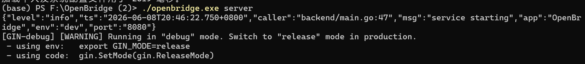

### 3.2 配置 `.env`

程序会自动生成 `.env`。也可以参考发布包中的 `.env.example` 手动配置。

常见配置项：

```env
OPENLIST_BASE_URL=http://127.0.0.1:5244
APP_VERSION=v1.3
ARIA2_RPC_URL=http://127.0.0.1:6800/jsonrpc
ARIA2_PATH=
RCLONE_PATH=
```

配置说明：

- `OPENLIST_BASE_URL`：OpenBridge 连接的 OpenList 地址。
- `APP_VERSION`：全局版本号，设置页底部会显示该版本。
- `ARIA2_RPC_URL`：aria2 JSON-RPC 地址。
- `ARIA2_PATH`：aria2c 可执行文件路径，可在设置页选择。
- `RCLONE_PATH`：rclone 可执行文件路径，可在设置页选择。


### 3.3 进入入口页

访问：

```text
http://localhost:<OpenBridge端口>
```

入口页按钮说明：

- `OpenBridge` 标识按钮：点击进入控制台。如果未登录，会进入登录页。
- `点击进入`：点击进入控制台。
- `登录`：跳转到登录页。


### 3.4 登录

操作步骤：

1. 打开 `/login`。
2. 在“用户名”中输入 OpenList 用户名。
3. 在“密码”中输入 OpenList 密码。
4. 点击“进入控制台”。

登录页按钮与状态：

- `进入控制台`：提交用户名和密码。
- `登录中...`：登录请求正在进行。
- 登录失败提示：用户名、密码、OpenList 地址或 OpenList 限流异常时显示。


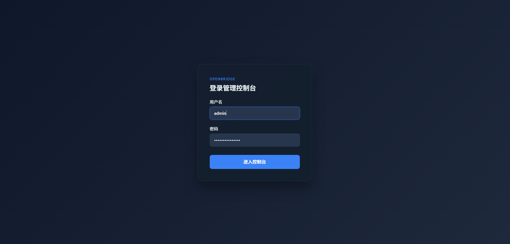

## 4. 页面导航与公共按钮

### 4.1 左侧导航栏

管理员可见页面：

- 仪表盘
- OpenList
- 服务商
- 下载任务
- 配额管理
- Rclone
- 设置

普通用户可见页面：

- 仪表盘
- OpenList
- 服务商
- 下载任务

调试页默认不在侧边栏展示，管理员可以直接访问：

```text
/debug
```


### 4.2 移动端菜单

移动端顶部会显示菜单按钮。点击菜单按钮打开侧边栏，再点击任意菜单项跳转页面。

按钮说明：

- 菜单按钮：打开移动端侧边栏。
- 遮罩区域：点击关闭侧边栏。


### 4.3 顶部栏

顶部栏显示：

- OpenList 连接状态。
- 主机下行速度。
- 主机上行速度。
- aria2 当前传输速度。
- 语言切换按钮。
- 主题切换按钮。
- 登录或重新登录按钮。

按钮说明：

- `中文 / EN`：切换界面语言。
- 主题按钮：切换亮色模式和黑夜模式。
- `登录`：未登录时进入登录页。
- `重新登录`：退出当前会话并回到登录页。


## 5. 仪表盘

访问路径：

```text
/dashboard
```

仪表盘用于查看系统概况、存储容量、主机资源、服务健康和快捷入口。


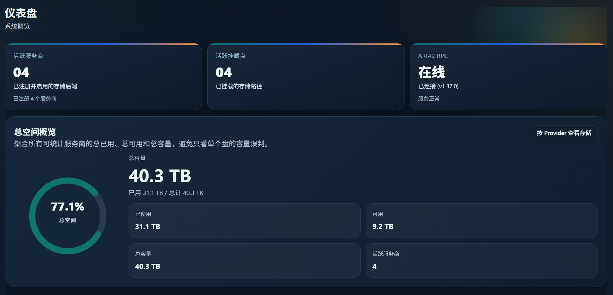

### 5.1 顶部统计卡片

顶部有 3 个统计卡片：

- 活跃服务商：显示已注册服务商数量。
- 活跃挂载点：显示已创建的 Mount 数量。
- aria2 RPC：显示 aria2 是否在线。

交互说明：

- 点击“活跃挂载点”卡片：展开或收起挂载点列表。


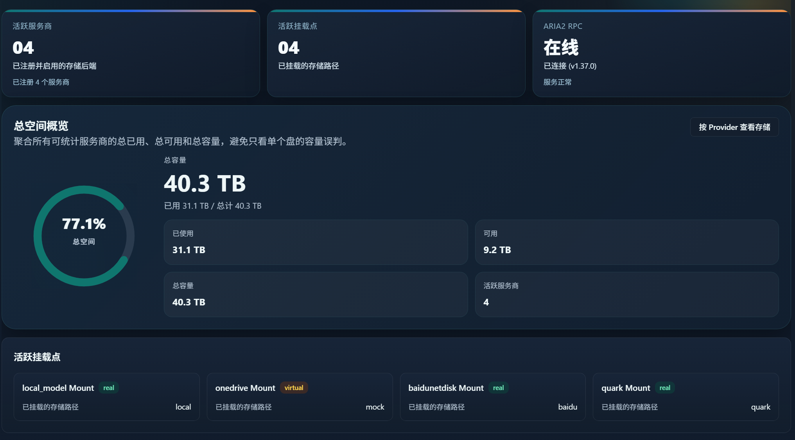

### 5.2 总空间概览

总空间概览展示所有可统计 Provider 的聚合容量：

- 总容量
- 已使用
- 可用
- Provider 数量

按钮说明：

- `按 Provider 查看存储`：展开每个 Provider 的容量卡片。
- `收起`：收起 Provider 容量卡片。
- Provider 容量卡片：点击后设置为默认展示对象，并收起列表。


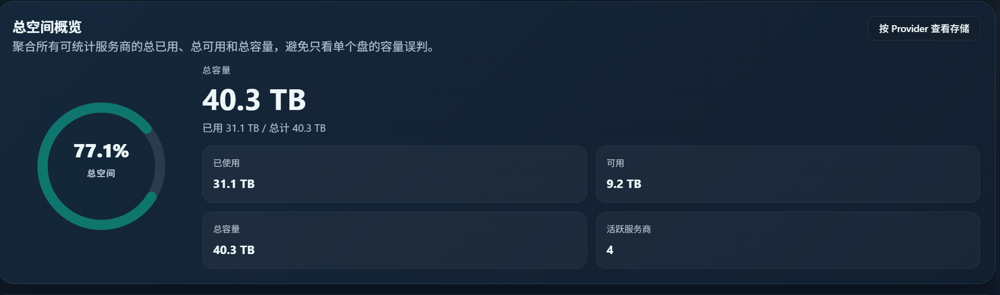

### 5.3 主机资源

主机资源显示运行 OpenBridge 的电脑状态：

- CPU 占用：整机占用和 OpenBridge 占用。
- 内存占用：整机内存和 OpenBridge 进程内存。
- 磁盘占用：分区总占用和 OpenBridge 应用目录占用。
- 主机上行和下行带宽。

按钮说明：

- `刷新`：立即重新读取主机资源数据。


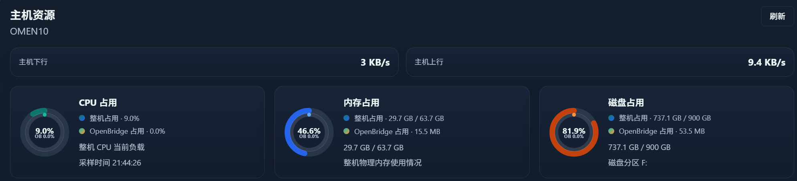

### 5.4 系统健康

系统健康展示：

- 后端 API 状态。
- aria2 RPC 状态。
- 配额同步状态。

状态说明：

- 绿色：正常。
- 灰色：未启用或暂无数据。
- 黄色：过期或待处理。
- 红色：异常。


### 5.5 快捷操作

快捷操作用于跳转到关键页面：

- 服务商：跳转 `/providers`。
- 文件：跳转 `/openlist`。
- 任务：跳转 `/tasks`。
- 配额：管理员可见，跳转 `/quota`。


## 6. OpenList 文件浏览

访问路径：

```text
/openlist
```

该页面用于浏览当前 OpenList 用户可见的文件和目录。


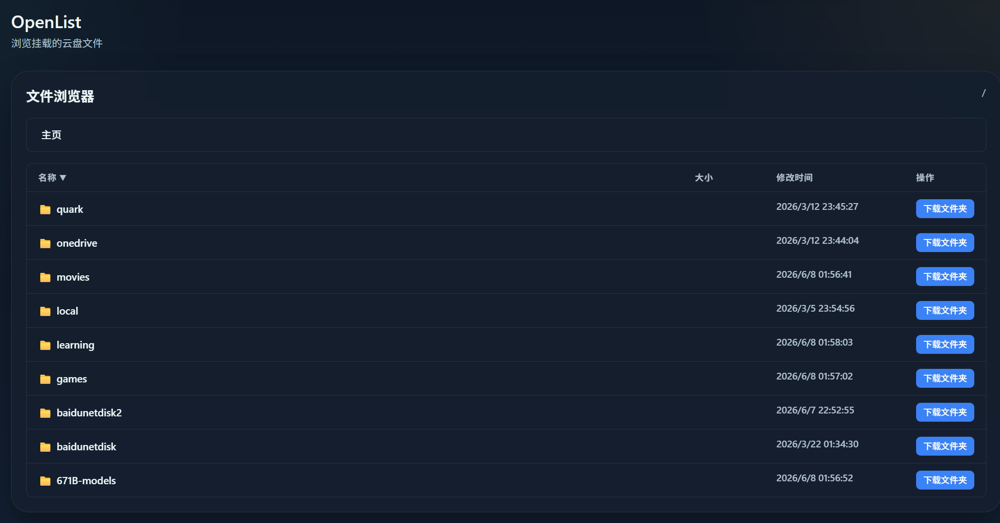

### 6.1 路径

页面顶部显示当前路径。

交互说明：

- 点击“主页”：返回当前用户可见根目录 `/`。
- 点击路径中的目录名：跳转到对应目录。


### 6.2 文件列表

文件列表列包含：

- 复选框
- 名称
- 大小
- 修改时间
- 操作

交互说明：

- 点击目录行：进入目录。
- 点击文件行：保持当前目录，可使用复选框或右侧操作按钮处理该文件。
- 表头复选框：全选或取消全选当前页文件。
- 行复选框：选中或取消选中单个文件或目录。
- 点击“名称”表头：按名称升序或降序排序。
- 点击“大小”表头：按大小升序或降序排序。
- 点击“修改时间”表头：按修改时间升序或降序排序。
- 文件较多时，前端会自动按分页继续加载，避免只显示前 50 个文件。

文件类型图标说明：

- `DIR`：文件夹。
- `IMG`：图片文件，例如 jpg、png、webp、svg。
- `VID`：视频文件，例如 mp4、mkv、avi。
- `AUD`：音频文件，例如 mp3、flac、wav。
- `ZIP`：压缩包，例如 zip、rar、7z、tar。
- `PDF`：PDF 文件。
- `DOC`：Office 文档，例如 docx、xlsx、pptx。
- `DEV`：代码或文本类开发文件，例如 go、ts、vue、json、md。
- `FILE`：其他普通文件。


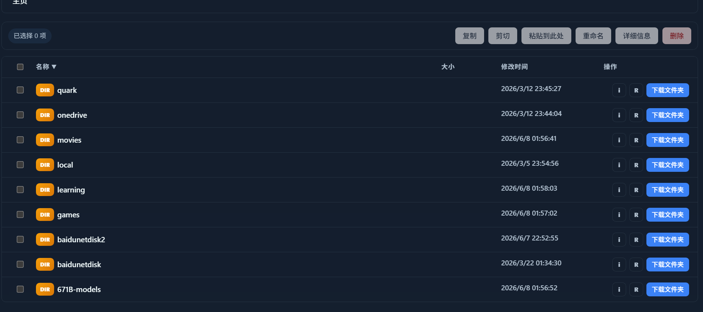

### 6.3 文件选择与批量操作

文件列表上方会显示批量操作工具栏。

工具栏按钮说明：

- `已选择 N 项`：显示当前选中文件或目录数量。
- `复制`：把当前选中的文件或目录加入复制剪贴板。
- `剪切`：把当前选中的文件或目录加入移动剪贴板。
- `粘贴到此处`：把剪贴板中的文件复制或移动到当前目录。
- `重命名`：仅选择 1 个项目时可用，输入新名称后提交到 OpenList。
- `详细信息`：仅选择 1 个项目时可用，读取并展示文件详情。
- `删除`：删除当前选中的文件或目录。

使用复制或剪切时，先在源目录勾选文件，再点击 `复制` 或 `剪切`，然后进入目标目录并点击 `粘贴到此处`。剪切成功后剪贴板会自动清空；复制成功后仍可继续粘贴到其他目录。

删除操作会直接调用 OpenList 删除接口，属于真实删除，不是只从 OpenBridge 列表中隐藏。执行前页面会弹出确认提示。

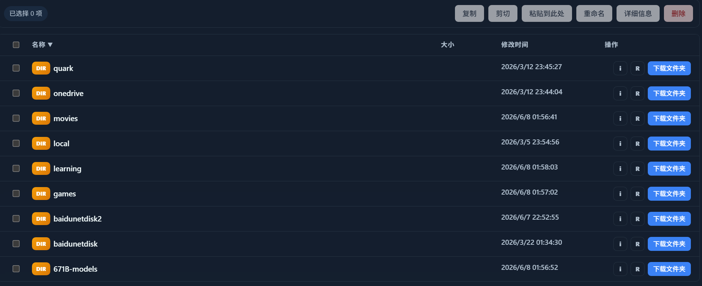

### 6.4 文件详情与行内操作

文件行右侧提供快捷按钮：

- `i`：打开详细信息面板。
- `R`：重命名该文件或目录。
- `下载 / 下载文件夹`：打开下载确认弹窗。

详细信息面板展示：

- 名称
- 类型
- 大小
- 修改时间
- 创建时间
- Provider
- OpenBridge 当前可见路径


### 6.5 下载文件或文件夹

文件和目录行右侧会显示下载按钮。

按钮说明：

- `下载`：对单个文件打开下载确认弹窗。
- `下载文件夹`：对文件夹打开下载确认弹窗。


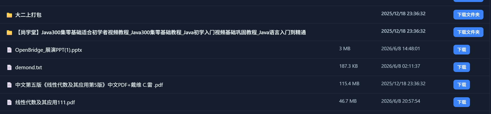

## 7. 下载确认弹窗

下载确认弹窗会在 OpenList 页面点击“下载”或“下载文件夹”时打开。


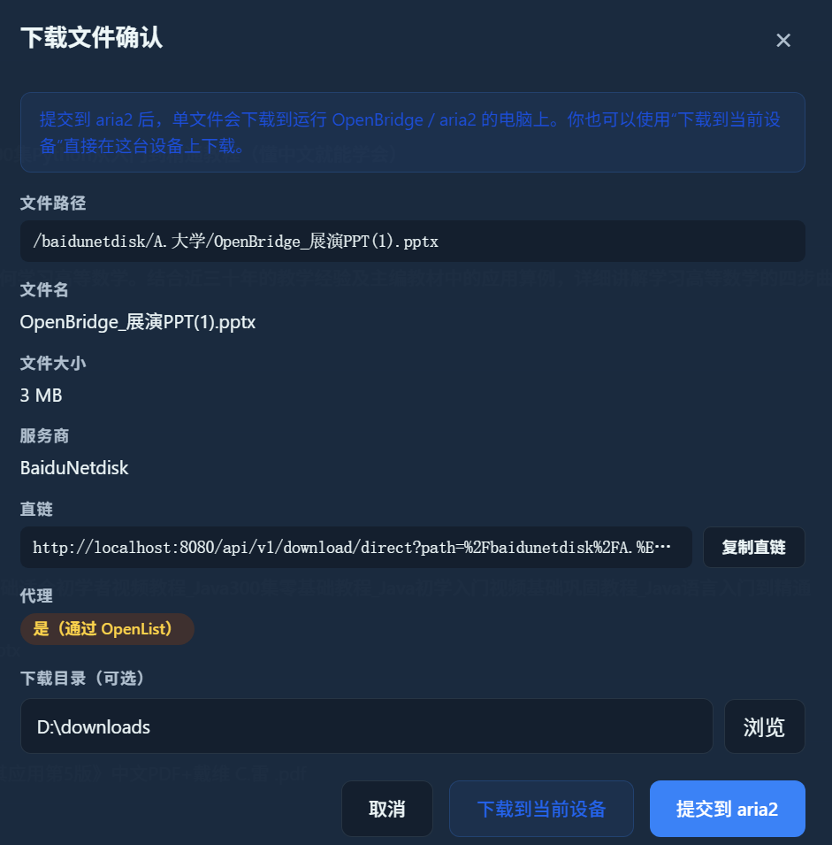

### 7.1 单文件下载

单文件弹窗显示：

- 文件路径
- 文件名
- 文件大小
- 服务商
- 直链
- 是否 OpenList 代理
- 下载目录

按钮说明：

- `下载到当前设备`：直接在当前浏览器所在设备下载文件。
- `提交到 aria2`：把下载任务提交给运行 OpenBridge 的电脑上的 aria2。
- `复制直链`：复制解析出的直链。
- `生成二维码`：为非 OpenList 代理直链生成二维码。
- `取消`：关闭弹窗。
- `完成 / 关闭`：下载任务创建完成后关闭弹窗。
- 右上角 `×`：关闭弹窗。


### 7.2 文件夹下载

文件夹弹窗会先扫描目录结构并统计：

- 服务商
- 文件数量
- 总大小

下载目录说明：

- 下载文件夹到 aria2 时必须提供目标目录。
- 系统会在目标目录下创建以文件夹名命名的子目录，并保留原始目录结构。


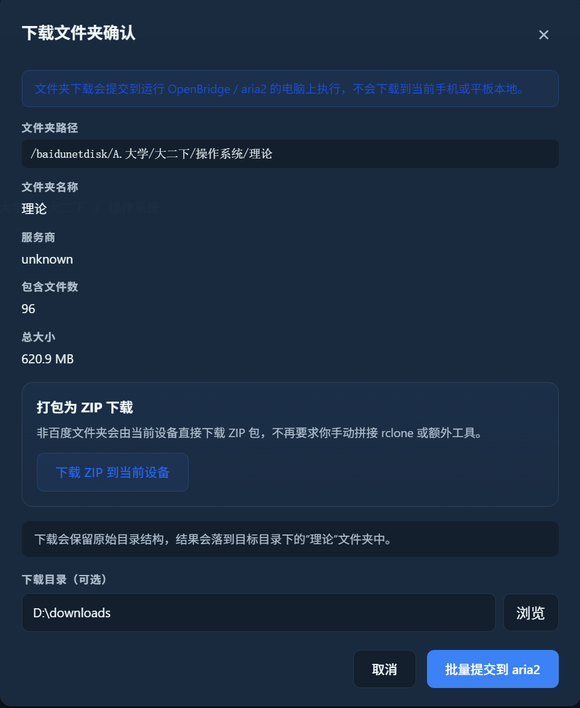


### 7.3 下载目录选择

下载目录输入框用于提交 aria2 时指定服务端电脑上的目录。

按钮说明：

- 输入框右侧的浏览按钮：打开本机目录选择器。
- 留空：使用默认下载目录。


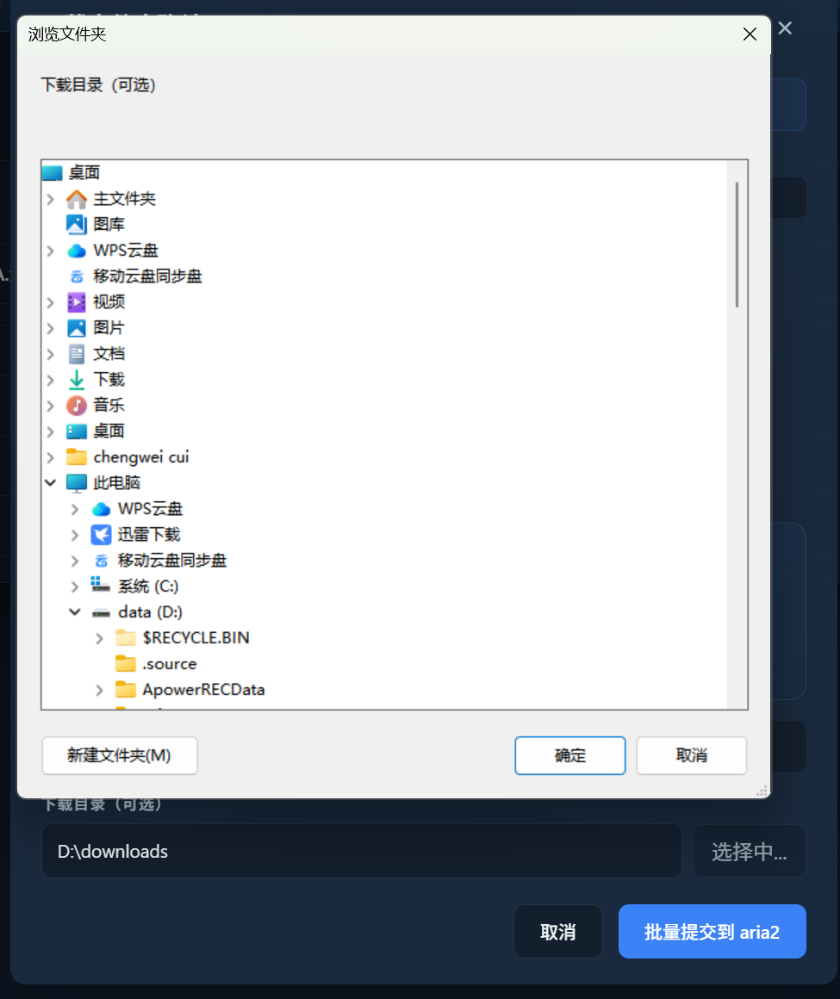

## 8. 下载任务

访问路径：

```text
/tasks
```

下载任务页面只统计由服务端电脑上的 aria2 执行的下载任务。当前设备直链下载和 ZIP 下载不会进入该任务列表。


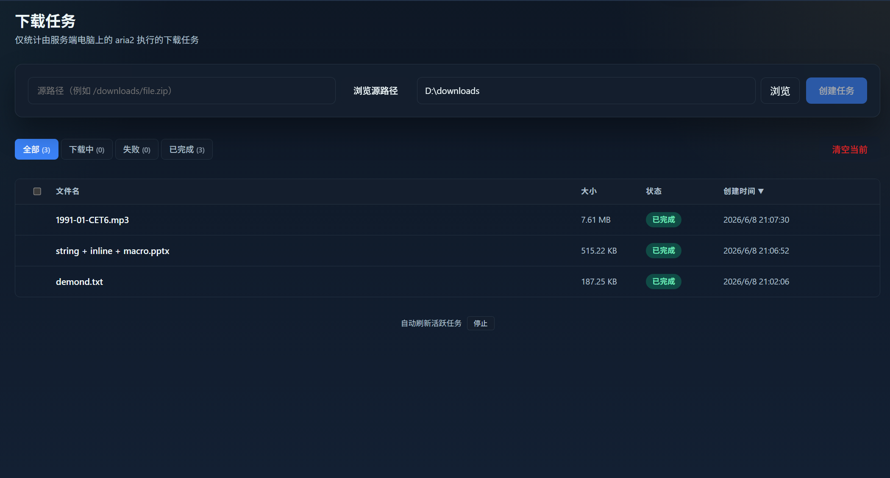

### 8.1 创建任务

页面顶部可直接创建下载任务。

操作步骤：

1. 在“源路径”输入 OpenList 文件路径，例如 `/downloads/file.zip`。
2. 点击“浏览源路径”可打开 OpenList 文件选择器。
3. 在“目标目录”填写服务端电脑上的下载目录。
4. 点击“创建任务”。

按钮说明：

- `浏览源路径`：打开 OpenList 文件浏览器，选择文件或文件夹。
- `创建任务`：创建 aria2 下载任务。
- `创建中...`：任务正在提交。


### 8.2 OpenList 源路径选择器

源路径选择器用于从 OpenList 文件树中选择文件或文件夹。

按钮说明：

- `×`：关闭选择器。
- `选择目录`：跳转到对应路径。
- `选择当前文件夹`：把当前目录作为源路径。
- `选择文件`：选择该文件。
- `打开文件夹`：进入该文件夹。


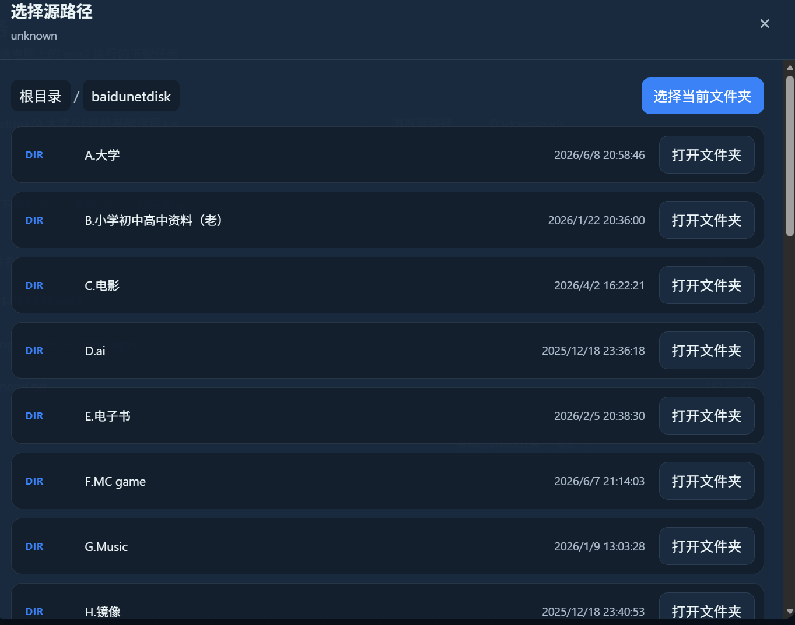

### 8.3 任务筛选

任务列表上方提供状态筛选。

筛选项：

- 全部
- 等待中
- 下载中
- 已暂停
- 已停止
- 文件已删除
- 失败
- 已完成

按钮说明：

- 点击任意筛选项：只显示对应状态的任务。


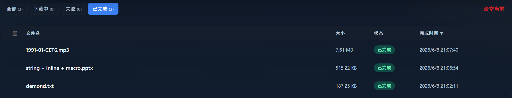

### 8.4 清除任务记录

按钮说明：

- `清除`：有勾选任务时，清除选中的任务记录。
- `清空当前`：没有勾选任务时，清空当前筛选条件下的任务记录。
- 表头复选框：全选或取消全选当前列表。
- 行复选框：选择单条任务。
- 行内删除图标：清除该条任务记录。

注意：清除记录只影响前端记录和本地任务列表，不等同于删除已经下载到磁盘上的文件。
如需删除已经下载到服务端电脑磁盘上的文件，请使用任务行或任务详情中的 `删除文件` 操作。


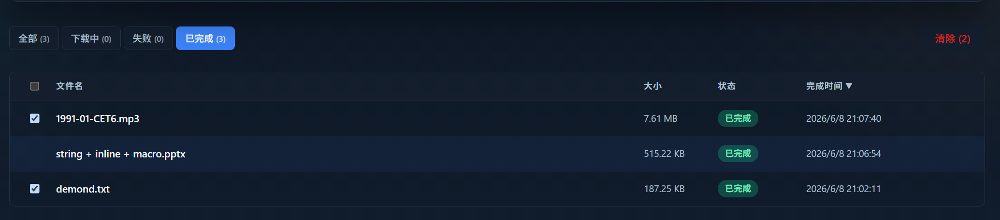

### 8.5 任务排序

点击表头可排序：

- 文件名
- 大小
- 状态
- 创建时间或完成时间

同一个表头再次点击会切换升序和降序。


### 8.6 任务行操作

任务行按钮说明：

- `在电脑上打开文件`：在运行 OpenBridge 的电脑上打开已下载文件。
- `在电脑上显示所在文件夹`：打开文件所在目录并定位。
- `停止下载`：停止等待中、下载中或暂停中的 aria2 任务。
- `删除文件`：删除该任务已经下载到服务端电脑磁盘上的文件，但保留任务记录。
- `清除记录`：只清除任务记录，不删除磁盘文件。
- `重试下载`：失败或已停止任务会重新解析直链并提交 aria2。
- 行点击：打开右侧或下方任务详情。

进度显示说明：

- 优先展示 aria2 返回的 `CompletedLength / TotalLength`。
- 当 aria2 暂时没有返回完整进度时，会结合当前下载速度做进度预测。
- 下载速度按 aria2 当前速度显示，活跃任务默认每秒刷新一次。


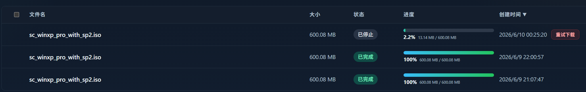

### 8.7 任务详情

任务详情包含：

- 任务 ID
- 源路径
- 文件名
- 文件大小
- aria2 GID
- 状态
- 进度
- 已下载大小
- 总大小
- 当前下载速度
- 重试次数
- 错误信息
- 直链
- 开始时间
- 完成时间
- 创建时间
- 更新时间

按钮说明：

- `关闭`：关闭任务详情。
- `停止下载`：停止仍在等待、下载或暂停的任务。
- `删除文件`：删除该任务对应的服务端本地文件，并把任务状态更新为“文件已删除”。
- `重试下载`：重新提交失败或已停止任务。
- `点击复制`：复制直链。


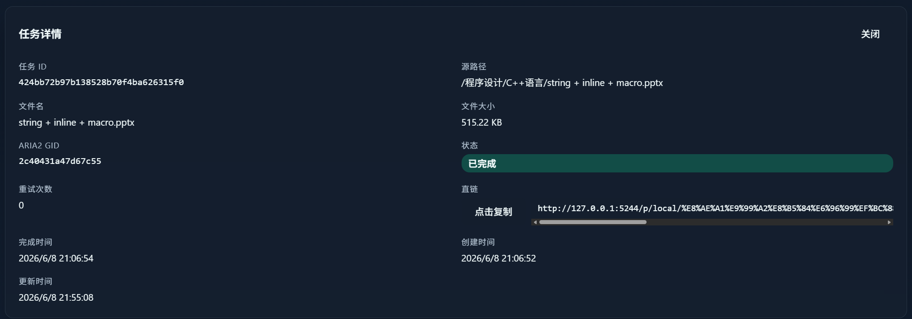

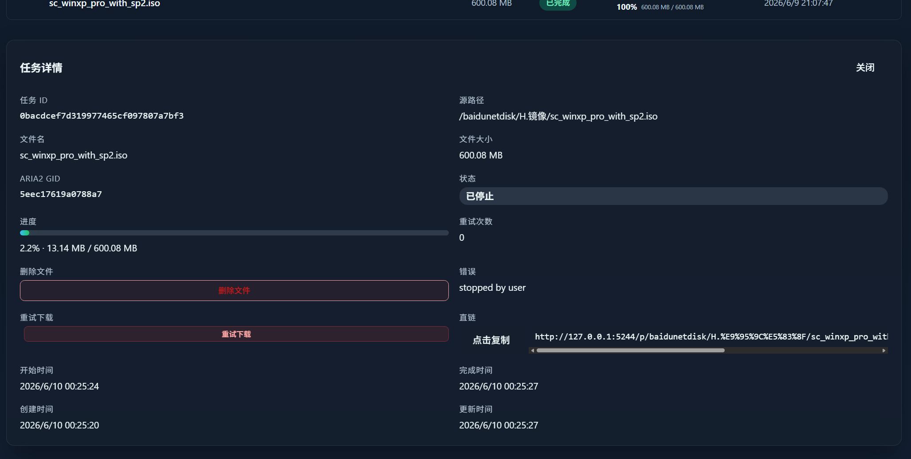

### 8.8 自动刷新

当存在等待中、下载中或暂停中的任务时，页面会自动刷新，默认每秒刷新一次。

按钮说明：

- `停止`：停止自动刷新活跃任务。
- `停止选中`：当选中任务中存在可停止任务时出现，批量停止选中的活跃任务。


## 9. 服务商管理

访问路径：

```text
/providers
```

服务商页面用于查看、注册、编辑和删除 Provider。

普通用户可以查看服务商列表。管理员可以新增、编辑和删除。


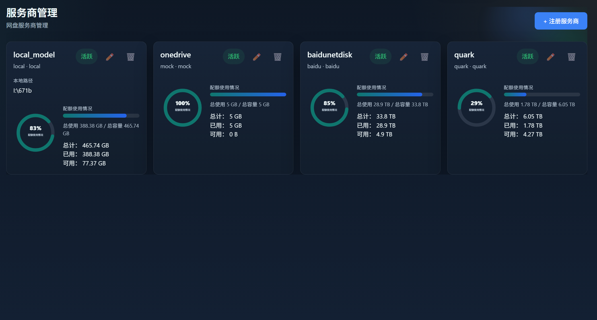

### 9.1 服务商卡片

卡片显示：

- 服务商名称
- Provider 类型
- 网盘类型
- 状态
- 本地路径或账号信息
- 配额使用情况
- 最后错误

按钮说明：

- 编辑按钮：打开编辑服务商弹窗。
- 删除按钮：删除该服务商。


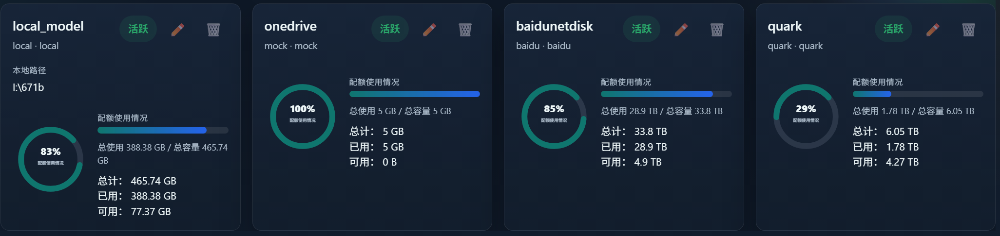

### 9.2 注册服务商

操作步骤：

1. 点击“+ 注册服务商”。
2. 填写名称。
3. 选择后端类型。
4. 按类型填写认证信息。
5. 选择状态。
6. 点击“注册”。

按钮说明：

- `+ 注册服务商`：打开注册弹窗。
- `×`：关闭弹窗。
- `取消`：关闭弹窗并放弃修改。
- `注册 / 保存`：提交表单。


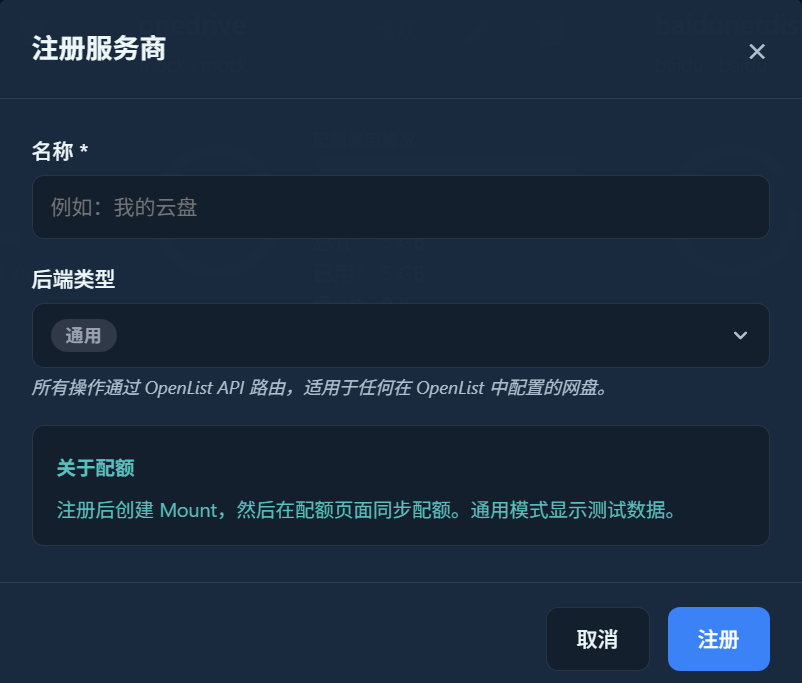

### 9.3 后端类型

后端类型按钮说明：

- `通用`：适用于所有 OpenList 中已有网盘。
- `百度网盘`：需要百度 access_token，支持直接下载。
- `夸克网盘`：需要夸克 Cookie，支持配额同步。
- `本地存储`：读取本机目录所在磁盘容量。


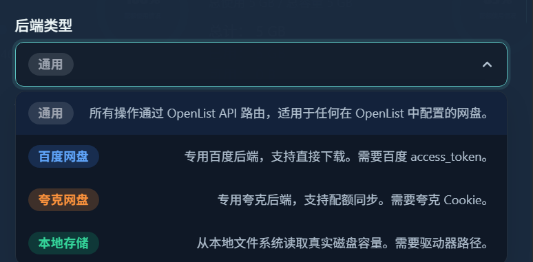

### 9.4 本地存储

本地存储字段：

- 本地文件夹路径：例如 `D:\Downloads`，需要和Openlist挂载的本地路径一致。

按钮说明：

- 路径输入框右侧浏览按钮：调起本机目录选择器。


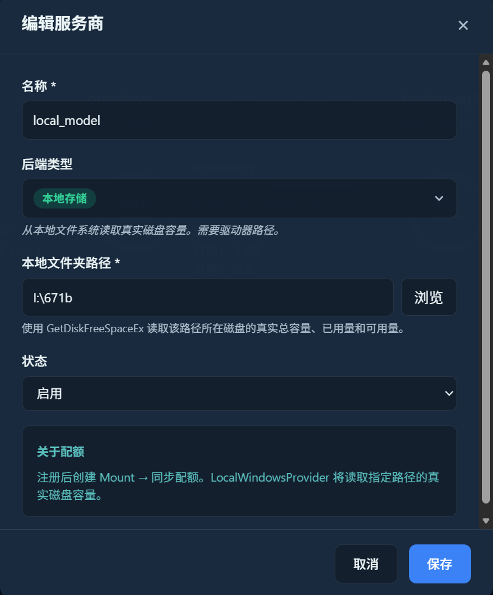

### 9.5 百度网盘

百度字段：

- 百度 Access Token：填写百度 access_token。
- 账户 ID：可选，用于区分多个账号。

按钮说明：

- `点我获取 Token`：打开获取 Token 的参考入口或提示。


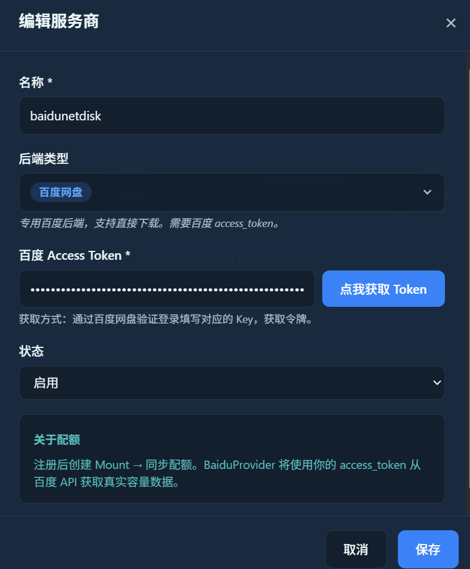

### 9.6 夸克网盘

夸克字段：

- 夸克 Cookie：填写从浏览器请求头复制的 Cookie。
- 账户 ID：可选，用于区分多个账号。

按钮说明：

- `点我获取 Cookie`：打开获取 Cookie 的参考入口或提示。


### 9.7 编辑和删除

编辑操作：

1. 点击服务商卡片右上角编辑按钮。
2. 修改字段。
3. 点击“保存”。

删除操作：

1. 点击服务商卡片右上角删除按钮。
2. 在确认框中确认删除。

注意：删除服务商可能影响该服务商下已有 Mount、配额和 rclone 配置。


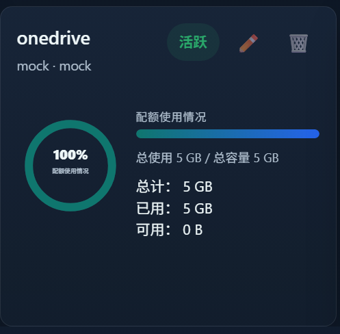

## 10. 配额管理

访问路径：

```text
/quota
```

权限：管理员。

配额管理页面用于创建 Mount、同步配额、编辑 Mount 和删除 Mount。


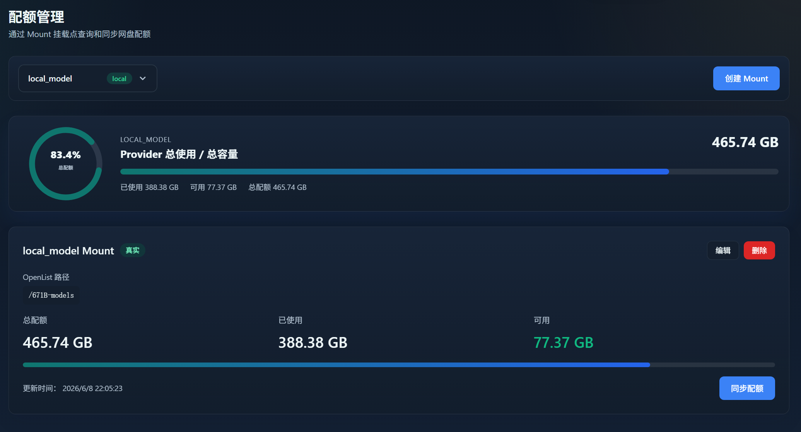

### 10.1 选择 Provider

页面顶部有 Provider 下拉框。

按钮说明：

- Provider 下拉框：展开当前 OpenList 源下的 Provider 列表。
- Provider 选项：切换当前管理的服务商。


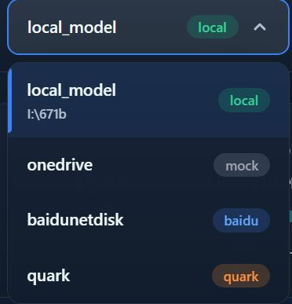

### 10.2 Provider 总容量

选择 Provider 后会显示该 Provider 的总使用情况：

- 总配额
- 已使用
- 可用
- 使用比例


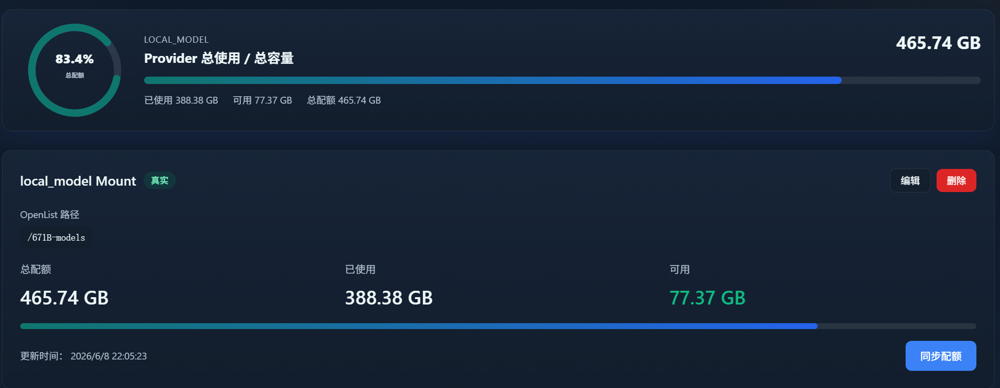

### 10.3 创建 Mount

操作步骤：

1. 点击“创建 Mount”。
2. 在“OpenList 路径”填写真实存在的 OpenList 路径，例如 `/movie`。
3. 选择配额模式。
4. 如果选择虚拟模式，填写虚拟总容量。
5. 点击“创建 Mount 并查询配额”。

按钮说明：

- `创建 Mount`：展开或收起创建表单。
- `Openlist路径`：Openlist真实路径，必须为英文
- `真实`：使用真实容量。
- `虚拟`：使用手动指定容量。
- `创建 Mount 并查询配额`：创建挂载点。


### 10.4 Mount 卡片

Mount 卡片显示：

- Mount 名称
- 配额模式
- OpenList 路径
- 总配额
- 已使用
- 可用
- 进度条
- 更新时间

按钮说明：

- `同步配额`：从 Provider 或虚拟配置重新计算配额。
- `编辑`：进入编辑模式。
- `删除`：打开删除确认弹窗。


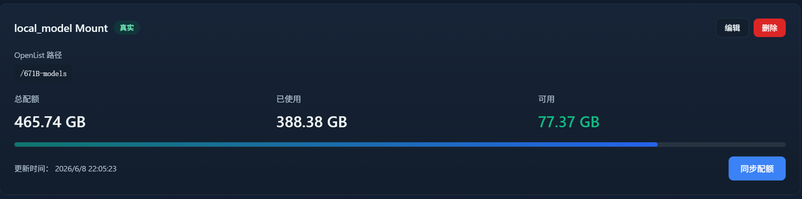

### 10.5 编辑 Mount

编辑字段：

- 名称
- OpenList 路径
- 配额模式
- 虚拟总容量
- 虚拟已用量

按钮说明：

- `保存`：提交修改。
- `取消`：退出编辑模式。


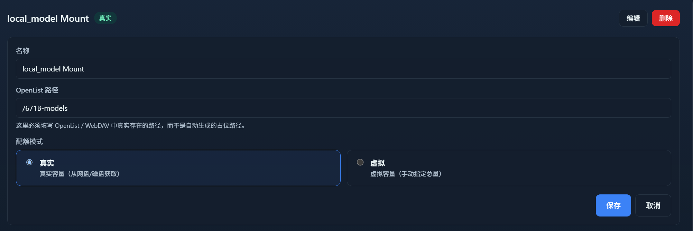

### 10.6 删除 Mount

操作步骤：

1. 点击 Mount 卡片上的“删除”。
2. 在弹窗中点击“删除”确认。

按钮说明：

- `删除`：确认删除。
- `取消`：关闭弹窗。


## 11. Rclone 挂载配置

访问路径：

```text
/rclone
```

权限：管理员。

Rclone 页面用于创建、编辑、删除、写入、挂载和停止本机 rclone 配置。


### 11.1 新增配置

操作步骤：

1. 点击“新增配置”。
2. 填写挂载配置名。
3. 选择挂载方式。
4. 选择一个或多个 Mount。
5. 填写用户名和密码。
6. 填写本地挂载路径或盘符。
7. 点击“保存”。

按钮说明：

- `新增配置`：打开配置弹窗。
- `×`：关闭弹窗。
- `取消`：放弃保存。
- `保存`：保存配置。


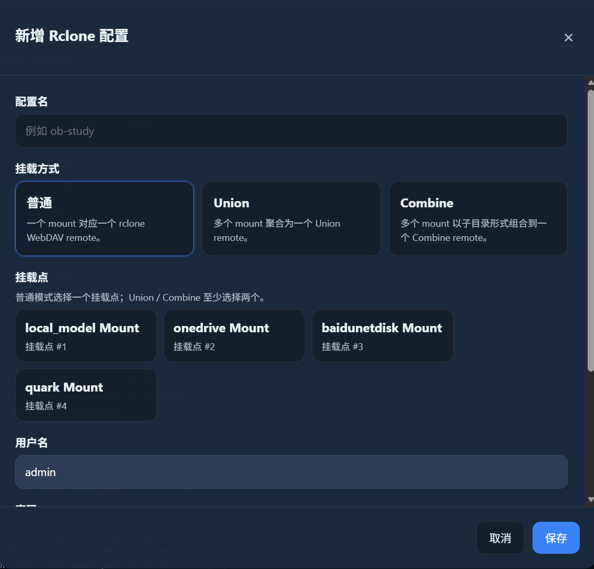

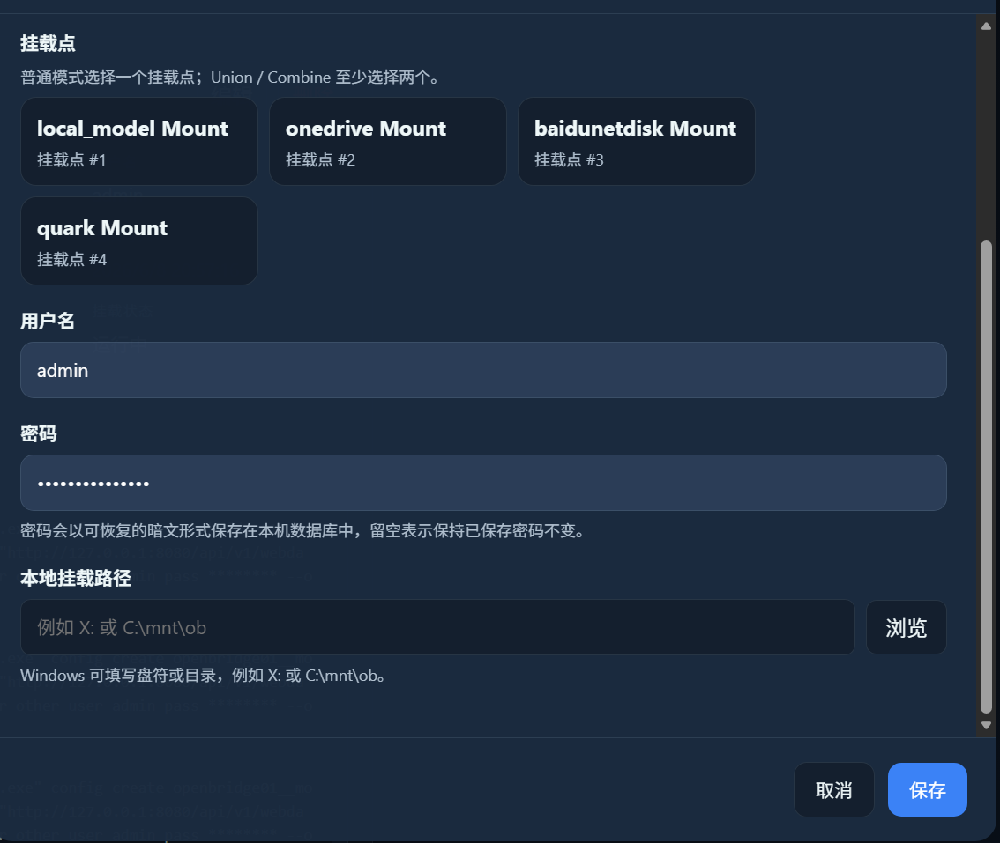

### 11.2 挂载方式

挂载方式说明：

- 普通：一个 Mount 对应一个 rclone WebDAV remote。
- union：多个 Mount 合并为 union remote。
- combine：多个 Mount 组合为 combine remote，保留各 Mount 的子目录识别。


### 11.3 选择 Mount

弹窗中会展示当前 OpenList 源下可用的 Mount。

按钮说明：

- Mount 选项按钮：点击选中或取消选中。

注意：

- 普通模式通常选择一个 Mount。
- union 和 combine 可以选择多个 Mount。


### 11.4 配置卡片

配置卡片显示：

- 配置名
- 挂载方式
- Mount ID
- 用户名
- 目标路径
- 是否已保存密码
- 是否已挂载
- 写入命令
- 挂载命令
- 最后错误

按钮说明：

- `编辑`：打开编辑弹窗。
- `删除`：删除该配置。
- `复制`：复制写入命令或挂载命令。
- `写入 rclone 配置`：执行 rclone 配置写入。
- `挂载`：启动 rclone mount。
- `停止挂载`：停止该配置对应的 rclone mount。


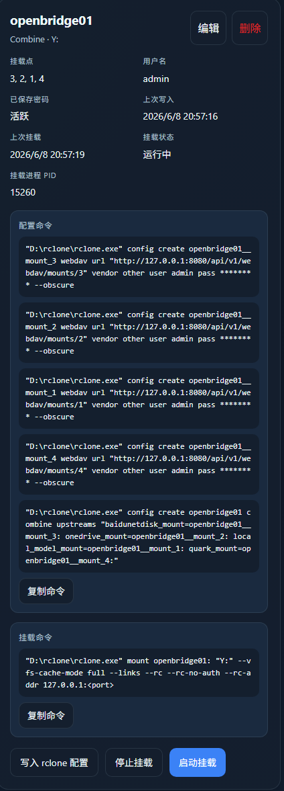

### 11.5 删除配置

操作步骤：

1. 点击配置卡片上的“删除”。
2. 确认后删除配置。

删除配置会同步清理 OpenBridge 管理的 rclone remote 信息。若 Mount 已删除，旧配置会在刷新或操作时更新状态。


### 11.6 常见 rclone 使用顺序

推荐顺序：

1. 在设置页填写 rclone 路径。
2. 在配额页创建 Mount。
3. 在 Rclone 页新增配置。
4. 点击“写入 rclone 配置”。
5. 点击“挂载”。
6. 不需要时点击“停止挂载”。


## 12. 设置

访问路径：

```text
/settings
```

权限：管理员。

设置页用于管理 OpenList、aria2、rclone、登录设备数、文件索引缓存、本地偏好和服务控制。


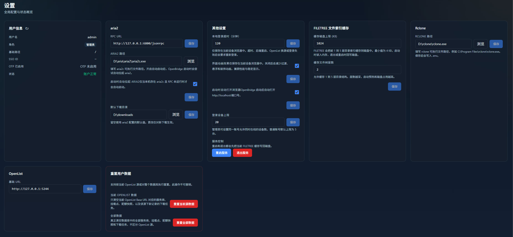

### 12.1 当前用户信息

页面会显示当前 OpenList 用户信息：

- 用户名
- 用户 ID
- 角色
- 根目录
- 是否禁用
- 权限值

按钮说明：

- `刷新`：重新读取当前用户信息。
- `重试`：用户信息读取失败后重新请求。


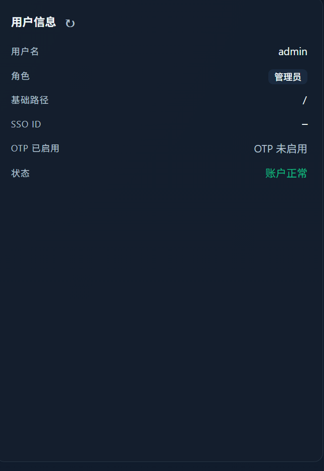

### 12.2 aria2 设置

字段说明：

- RPC URL：aria2 RPC 地址，默认 `http://127.0.0.1:6800/jsonrpc`。
- aria2 路径：aria2c 可执行文件路径。
- 启动时自动拉起 aria2：OpenBridge 启动时自动尝试启动 aria2。

按钮说明：

- RPC URL 旁 `保存`：保存 RPC URL。
- aria2 路径输入框右侧浏览按钮：选择 aria2c 可执行文件。
- 自动启动开关：开启或关闭自动启动。
- 自动启动区域的 `保存`：保存 aria2 路径和自动启动配置。


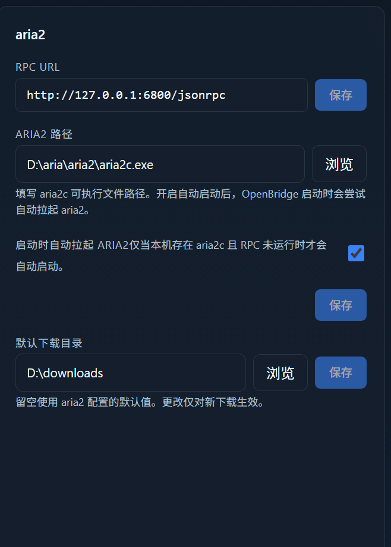

### 12.3 默认下载目录

字段说明：

- 默认下载目录：提交 aria2 下载时的默认目标目录。

按钮说明：

- 输入框右侧浏览按钮：选择本机目录。
- `保存`：保存默认下载目录。


### 12.4 其他设置

其他设置包含：

- 本地登录超时：仅保存在当前设备浏览器中。
- 界面动画效果：仅保存在当前设备浏览器中。
- 启动时自动打开浏览器：写入后端配置。
- 登录设备上限：管理员设置同一账号允许同时在线设备数。
- 页面底部版本号：来自 `.env` 中的 `APP_VERSION`，例如 `OpenBridge v1.3`。

按钮说明：

- 本地登录超时旁 `保存`：保存当前设备的登录超时时间。
- 界面动画效果开关：开启或关闭动画。
- 界面动画效果旁 `保存`：保存本地动画偏好。
- 启动时自动打开浏览器开关：开启或关闭。
- 启动时自动打开浏览器旁 `保存`：保存后端配置。
- 登录设备上限旁 `保存`：保存设备数量限制。


### 12.5 服务控制

按钮说明：

- `重启服务`：提交重启请求。重启前会尝试把 FILETREE 缓存写回磁盘。
- `退出服务`：提交退出请求。退出前会尝试把 FILETREE 缓存写回磁盘。

注意：退出服务后当前页面将无法继续访问，需要重新启动 OpenBridge。


### 12.6 FILETREE 文件索引缓存

字段说明：

- 缓存磁盘上限：最小 4 KB。
- 缓存文件树层数：允许 1 到 5 层。

按钮说明：

- `保存`：保存 FILETREE 缓存大小和层数。

说明：

- 启动时会读取磁盘缓存到内存。
- 运行中会更新内存缓存。
- 退出或重启时会写回磁盘。
- 预热不应阻塞正常文件浏览。


### 12.7 Rclone 路径

字段说明：

- Rclone 路径：rclone 可执行文件路径，例如 `D:\rclone\rclone.exe`。

按钮说明：

- 输入框右侧浏览按钮：选择 rclone 可执行文件。
- `保存`：写入 `.env` 并保存到后端配置。


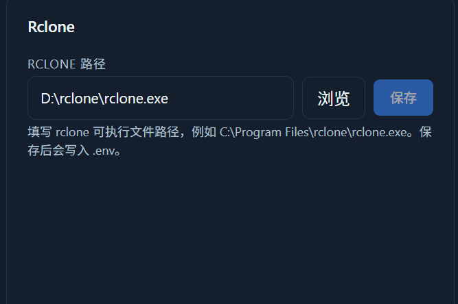

### 12.8 OpenList 设置

字段说明：

- OpenList 基础 URL：OpenBridge 连接的 OpenList 地址。

按钮说明：

- `保存`：保存 OpenList Base URL。

注意：

- 更换 OpenList Base URL 后，需要重新登录。
- 服务商、Mount、rclone 配置和文件浏览数据会按 OpenList 源隔离。


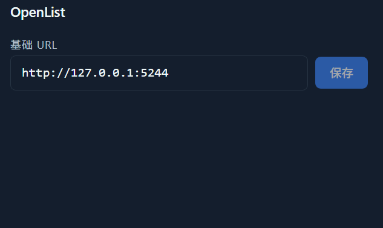

### 12.9 备份与还原用户数据

备份与还原功能用于迁移或保护 OpenBridge 的完整用户数据。

备份内容包括：

- 服务商账号数据。
- Mount 挂载点数据。
- 配额快照数据。
- 下载任务记录。
- rclone 挂载配置。
- 设置页中的配置项，例如 OpenList Base URL、aria2 RPC、aria2 路径、rclone 路径、登录设备上限、FILETREE 缓存设置、自动打开浏览器等。

字段说明：

- 备份密码：可选。留空时生成未加密 JSON 备份文件。
- 备份文件：还原时选择 OpenBridge 导出的 JSON 文件。
- 还原密码：仅加密备份需要填写；未加密备份无需密码。

按钮说明：

- `导出备份`：导出全部用户数据。若填写了备份密码，导出的备份文件会加密。
- `还原备份`：从备份文件覆盖还原当前全部用户数据，并把设置项写回 `.env`。

注意：

- 未设置密码的备份是明文文件，可能包含 token、cookie、OpenList 地址、aria2 配置和 rclone 配置等敏感信息。
- 加密备份还原时必须输入创建备份时使用的密码，密码错误无法还原。
- 还原会覆盖当前全部用户数据，执行前请确认已经保存好当前数据。
- 设置项会写回 `.env`；端口、aria2、rclone、FILETREE 等部分运行时配置建议重启 OpenBridge 后完全生效。
- 当前数据库路径 `DB_PATH` 不会被备份覆盖，避免还原后切换到另一个数据库文件导致数据不可见。
- 还原完成后前端会退出当前会话，需要重新登录。


### 12.10 重置用户数据

重置分为两种：

- 当前 OpenList 数据：只清空当前 OpenList Base URL 对应的数据。
- 全部数据：清空数据库中的全部服务商、Mount、配额快照和下载任务。

按钮说明：

- `重置当前源数据`：清空当前 OpenList 源的数据。
- `重置全部数据`：清空全部源的数据。


## 13. 调试页面

访问路径：

```text
/debug
```

权限：管理员。

调试页默认不显示在侧边栏中，需要手动访问。


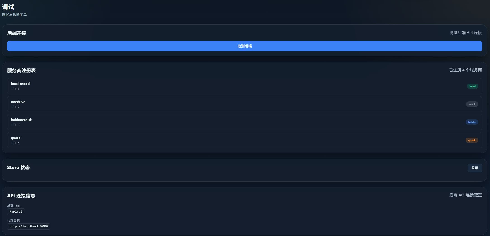

### 13.1 API 连通性检测

按钮说明：

- `Ping API`：向后端发送测试请求，验证 API 是否可达。


### 13.2 Store 状态

按钮说明：

- `显示 Store / 隐藏 Store`：展开或收起前端 Store 状态。

用途：

- 查看当前登录态。
- 查看服务商、Mount、任务 ID 等前端缓存。


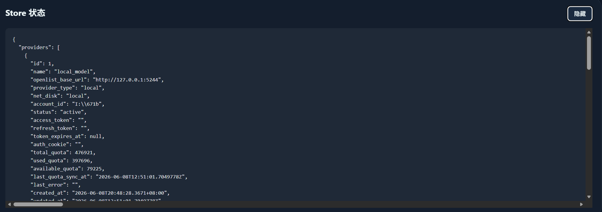

### 13.3 重置用户数据

按钮说明：

- `重置用户数据`：执行调试用重置操作。

生产环境建议优先使用设置页中的“重置当前源数据”或“重置全部数据”。


## 14. WebDAV Mount 用法

OpenBridge 提供按 Mount 暴露的 WebDAV 代理。

地址格式：

```text
http://<OpenBridge主机>:<端口>/api/v1/webdav/mounts/<mount_id>
```

示例：

```text
http://127.0.0.1:8080/api/v1/webdav/mounts/12
```

特点：

- 文件能力复用 OpenList WebDAV。
- 容量展示使用 OpenBridge Mount 层配额。
- 认证头会继续转发给 OpenList。

rclone 示例：

```powershell
rclone config create ob-mount-12 webdav url http://127.0.0.1:8080/api/v1/webdav/mounts/12 vendor other user admin pass your_password
rclone mount ob-mount-12: X: --vfs-cache-mode full
```


## 15. API 文档

### 15.1 基础信息

默认 API Base URL：

```text
/api/v1
```

完整示例：

```text
http://127.0.0.1:8080/api/v1/provider/list
```

### 15.2 设备请求头

前端会自动携带：

```http
X-OpenBridge-Device-ID: <device_id>
```

该请求头用于区分设备会话、OpenList 用户根目录和设备登录限制。外部调用 API 时建议也提供稳定的设备 ID。

### 15.3 通用响应格式

后端响应通常为：

```json
{
  "code": 1000,
  "message": "success",
  "data": {}
}
```

前端兼容：

- `code = 1000`
- `code = 0`

错误响应示例：

```json
{
  "code": 40001,
  "message": "error message",
  "data": null
}
```

### 15.4 权限说明

公开接口：

- `POST /user/login`
- 前端静态页面

登录后可用接口：

- 用户信息
- 文件浏览
- 下载任务
- 服务商列表
- Mount 查询
- 主机资源查询

管理员接口：

- 注册、编辑、删除服务商
- 创建、编辑、删除 Mount
- 更新设置
- 备份和还原全部用户数据
- rclone 配置写入、挂载、停止挂载
- 重启和退出服务

### 15.5 User API

#### POST `/user/login`

用途：登录 OpenBridge 控制台。

请求体：

```json
{
  "username": "admin",
  "password": "password"
}
```

返回：

```json
{
  "code": 1000,
  "message": "success",
  "data": {
    "token": "..."
  }
}
```

#### GET `/user/info`

用途：获取当前 OpenList 用户信息。

返回字段：

- `id`
- `username`
- `base_path`
- `role`
- `disabled`
- `permission`
- `sso_id`
- `otp`

#### GET `/user/session-status`

用途：检查当前设备会话是否仍有效。

返回字段：

- `authenticated`
- `backend_instance_id`
- `openlist_base_url`
- `fingerprint`
- `device_id`
- `device_limit`
- `active_device_count`
- `username`
- `role`
- `checked_at`
- `reason`

#### DELETE `/user/reset?scope=current|all`

权限：管理员。

用途：重置用户数据。

参数：

- `scope=current`：重置当前 OpenList 源数据。
- `scope=all`：重置全部数据。

#### POST `/user/backup`

权限：管理员。

用途：导出全部用户数据备份。

请求体：

```json
{
  "password": "可选备份密码"
}
```

说明：

- `password` 为空时导出未加密 JSON。
- `password` 不为空时使用该密码加密备份内容。
- 备份文件包含数据库用户数据和设置页对应的 `.env` 配置项。
- 返回值是可下载的 JSON 备份文件，不使用通用响应格式。

#### POST `/user/restore`

权限：管理员。

用途：从备份文件还原全部用户数据。

请求格式：`multipart/form-data`

字段：

- `file`：OpenBridge 导出的 JSON 备份文件。
- `password`：可选。加密备份必须填写创建备份时的密码，未加密备份可留空。

说明：

- 还原会覆盖当前数据库中的服务商、Mount、配额、下载任务和 rclone 配置。
- 还原会把备份中的设置项写回 `.env`。
- `DB_PATH` 不随备份覆盖。
- 还原成功后建议重新登录；如果恢复了端口或外部工具路径，建议重启 OpenBridge。

### 15.6 Settings API

#### GET `/settings`

用途：获取当前设置。

返回字段：

- `app_version`
- `openlist_base_url`
- `aria2_rpc_url`
- `aria2_path`
- `aria2_auto_start`
- `rclone_path`
- `session_device_limit`
- `auto_open_browser`
- `filetree_cache_size_kb`
- `filetree_cache_depth`

#### PUT `/settings/openlist`

权限：管理员。

请求体：

```json
{
  "base_url": "http://127.0.0.1:5244"
}
```

#### PUT `/settings/aria2`

权限：管理员。

请求体：

```json
{
  "rpc_url": "http://127.0.0.1:6800/jsonrpc",
  "path": "D:\\aria2\\aria2c.exe",
  "auto_start": true
}
```

#### PUT `/settings/rclone`

权限：管理员。

请求体：

```json
{
  "path": "D:\\rclone\\rclone.exe"
}
```

#### PUT `/settings/session`

权限：管理员。

请求体：

```json
{
  "device_limit": 5
}
```

#### PUT `/settings/app`

权限：管理员。

请求体：

```json
{
  "auto_open_browser": true
}
```

#### PUT `/settings/filetree`

权限：管理员。

请求体：

```json
{
  "cache_size_kb": 1024,
  "cache_depth": 2
}
```

限制：

- `cache_size_kb` 最小 4。
- `cache_depth` 最小 1，最大 5。

### 15.7 Storage API

#### GET `/storage/drivers`

用途：获取 OpenList 存储驱动列表。

#### GET `/storage/driverInfo?name=<driver>`

用途：获取指定驱动详情。

参数：

- `name`：驱动名称。

#### GET `/storage/files?path=/&page=1&per_page=50`

用途：获取当前用户可见路径下的文件列表。

参数：

- `path`：OpenList 可见路径。
- `page`：页码。
- `per_page`：每页数量。

说明：前端文件浏览器会按分页自动继续读取，直到当前目录数据读取完成或达到安全页数上限。

返回数据结构：

```json
{
  "content": [
    {
      "name": "file.zip",
      "size": 1024,
      "is_dir": false,
      "modified": "2026-06-08T00:00:00Z",
      "provider": "baidu"
    }
  ],
  "total": 1,
  "provider": "baidu"
}
```

#### GET `/storage/file?path=/file.zip`

用途：获取单个文件详情。

#### POST `/storage/files/remove`

用途：删除当前 OpenList 用户可见目录下的一个或多个文件或目录。

请求体：

```json
{
  "dir": "/movie",
  "names": ["old-file.zip", "old-folder"]
}
```

说明：

- `dir` 是 OpenBridge 当前可见目录。
- `names` 只能包含当前目录下的文件名或目录名，不能包含 `/` 或 `\`。
- 该操作会调用 OpenList 删除接口，属于真实删除。

#### POST `/storage/file/rename`

用途：重命名单个文件或目录。

请求体：

```json
{
  "path": "/movie/file.zip",
  "name": "new-file.zip"
}
```

说明：`name` 只能是新文件名，不能包含路径分隔符。

#### POST `/storage/files/copy`

用途：把一个或多个文件或目录复制到目标目录。

请求体：

```json
{
  "src_dir": "/movie",
  "dst_dir": "/backup/movie",
  "names": ["file.zip", "folder-a"]
}
```

#### POST `/storage/files/move`

用途：把一个或多个文件或目录移动到目标目录，对应前端“剪切 + 粘贴到此处”。

请求体：

```json
{
  "src_dir": "/movie",
  "dst_dir": "/archive/movie",
  "names": ["file.zip", "folder-a"]
}
```

返回示例：

```json
{
  "operation": "move",
  "dir": "/movie",
  "dst_dir": "/archive/movie",
  "names": ["file.zip"]
}
```

### 15.8 Download API

#### POST `/download/resolve`

用途：解析文件直链。

请求体：

```json
{
  "path": "/movie/file.mp4"
}
```

返回：

```json
{
  "path": "/movie/file.mp4",
  "name": "file.mp4",
  "size": 123456,
  "provider": "baidu",
  "direct_link": "https://...",
  "header": "",
  "is_openlist_proxy": false
}
```

#### GET `/download/direct?path=/file.zip&device_id=<device_id>`

用途：下载或代理指定文件直链。

说明：

- 如果解析结果是 OpenList 代理链接，会由 OpenBridge 转发。
- 如果解析结果是可直连链接，会跳转到真实直链。

#### HEAD `/download/direct?path=/file.zip&device_id=<device_id>`

用途：用于下载客户端预检文件信息。

#### GET `/download/folder-zip?path=/folder&device_id=<device_id>`

用途：把文件夹打包为 ZIP 并下载到当前设备。

#### POST `/download/tasks`

用途：创建 aria2 下载任务。

请求体：

```json
{
  "path": "/movie/file.mp4",
  "dir": "D:\\Downloads"
}
```

返回：下载任务对象或任务 ID。

#### GET `/download/tasks/:id`

用途：查询下载任务详情。

任务对象常见字段：

- `TaskID`
- `SourcePath`
- `FileName`
- `FileSize`
- `FilePath`
- `Aria2GID`
- `Status`
- `Progress`
- `CompletedLength`
- `TotalLength`
- `DownloadSpeed`
- `ErrorMessage`
- `RetryCount`
- `StartedAt`
- `FinishedAt`
- `CreatedAt`
- `UpdatedAt`

#### POST `/download/tasks/:id/stop`

用途：停止单个 aria2 下载任务。

说明：

- 仅对等待中、下载中或暂停中的任务有效。
- 成功后任务状态会更新为 `stopped`。

#### POST `/download/tasks/stop`

用途：批量停止多个 aria2 下载任务。

请求体：

```json
{
  "task_ids": ["task-1", "task-2"]
}
```

返回字段：

- `tasks`：成功停止并更新后的任务列表。
- `failed`：停止失败的任务 ID 与错误信息映射。

#### POST `/download/tasks/:id/delete-file`

用途：删除该任务已经下载到运行 OpenBridge 的电脑上的本地文件，并保留任务记录。

说明：

- 适用于已完成、已停止或失败任务。
- 成功后任务状态会更新为 `deleted`，前端显示“文件已删除”。

#### POST `/download/tasks/:id/retry`

用途：重试失败或已停止任务。

说明：

- 重试时会重新解析 OpenList 源路径的直链。
- 成功后重新提交 aria2，任务状态回到等待中。

#### POST `/download/tasks/:id/open`

用途：在运行 OpenBridge 的电脑上打开已下载文件。

返回：

```json
{
  "file_path": "D:\\Downloads\\file.mp4"
}
```

#### POST `/download/tasks/:id/open-location`

用途：在运行 OpenBridge 的电脑上打开文件所在目录。

返回：

```json
{
  "folder_path": "D:\\Downloads"
}
```

#### GET `/download/aria2-status`

用途：检查 aria2 RPC 状态。

返回：

```json
{
  "version": "1.37.0",
  "downloadSpeed": 0,
  "uploadSpeed": 0
}
```

### 15.9 Provider API

#### GET `/provider/list`

用途：获取当前 OpenList 源下的 Provider 列表。

#### GET `/provider/info?id=<id>`

用途：获取单个 Provider 详情。

#### POST `/provider`

权限：管理员。

用途：注册 Provider。

请求体示例：

```json
{
  "name": "百度网盘",
  "provider_type": "baidu",
  "net_disk": "baidu",
  "account_id": "account-1",
  "status": "active",
  "access_token": "..."
}
```

本地存储示例：

```json
{
  "name": "本地磁盘",
  "provider_type": "local",
  "net_disk": "local",
  "account_id": "D:\\Downloads",
  "status": "active"
}
```

#### PUT `/provider/`

权限：管理员。

用途：更新 Provider。

请求体需要包含 `id`。

#### DELETE `/provider?id=<id>`

权限：管理员。

用途：删除 Provider。

### 15.10 Mount API

#### GET `/mount`

用途：获取 Mount 列表。

#### POST `/mount`

权限：管理员。

用途：创建 Mount。

请求体示例：

```json
{
  "name": "movie",
  "provider_account_id": 1,
  "provider_type": "baidu",
  "mount_path": "/movie",
  "provider_root_path": "",
  "quota_mode": "real",
  "enabled": true
}
```

虚拟容量示例：

```json
{
  "name": "virtual-movie",
  "provider_account_id": 1,
  "provider_type": "baidu",
  "mount_path": "/movie",
  "quota_mode": "virtual",
  "virtual_total": 102400,
  "virtual_used": 0,
  "enabled": true
}
```

#### PUT `/mount/:id`

权限：管理员。

用途：更新 Mount。

#### DELETE `/mount/:id`

权限：管理员。

用途：删除 Mount。

#### GET `/mount/:id/quota`

用途：查询 Mount 当前配额。

返回：

```json
{
  "mount_id": 12,
  "mode": "real",
  "allowed_max": 0,
  "quota": {
    "provider": "baidu",
    "total": 102400,
    "used": 20480,
    "available": 81920,
    "updated_at": "2026-06-08T00:00:00Z"
  }
}
```

#### POST `/mount/:id/quota/sync`

用途：同步 Mount 配额。

### 15.11 Rclone API

#### GET `/rclone/profiles`

用途：获取当前 OpenList 源下的 rclone 配置。

#### POST `/rclone/profiles`

权限：管理员。

请求体：

```json
{
  "name": "openbridge",
  "mode": "ordinary",
  "mount_ids": [12],
  "username": "admin",
  "password": "password",
  "target_path": "X:"
}
```

`mode` 可选：

- `ordinary`
- `union`
- `combine`

#### PUT `/rclone/profiles/:id`

权限：管理员。

用途：更新 rclone 配置。

#### DELETE `/rclone/profiles/:id`

权限：管理员。

用途：删除 rclone 配置。

#### POST `/rclone/profiles/:id/apply`

权限：管理员。

用途：写入 rclone 配置。

#### POST `/rclone/profiles/:id/mount`

权限：管理员。

用途：启动 rclone mount。

#### POST `/rclone/profiles/:id/unmount`

权限：管理员。

用途：停止 rclone mount。

### 15.12 System API

#### POST `/system/pick-path`

用途：调起服务端本机文件或目录选择器。

请求体：

```json
{
  "kind": "directory",
  "title": "选择目录",
  "current_path": "D:\\Downloads",
  "filter": ""
}
```

`kind` 可选：

- `file`
- `directory`

返回：

```json
{
  "path": "D:\\Downloads"
}
```

#### GET `/system/metrics`

用途：获取主机资源指标。

返回字段：

- `cpu_usage`
- `process_cpu_usage`
- `memory_usage`
- `memory_used_bytes`
- `memory_total_bytes`
- `process_memory_bytes`
- `disk_usage`
- `disk_used_bytes`
- `disk_total_bytes`
- `app_disk_usage_bytes`
- `network_receive_bytes_per_sec`
- `network_transmit_bytes_per_sec`
- `disk_path`
- `hostname`
- `sampled_at`

#### POST `/system/restart`

权限：管理员。

用途：重启 OpenBridge 服务。

返回：

```json
{
  "accepted": true,
  "action": "restart"
}
```

#### POST `/system/exit`

权限：管理员。

用途：退出 OpenBridge 服务。

返回：

```json
{
  "accepted": true,
  "action": "exit"
}
```

### 15.13 WebDAV API

#### `/webdav/mounts/:id`

用途：把指定 Mount 暴露为 WebDAV 根。

支持方法：

- `OPTIONS`
- `PROPFIND`
- `GET`
- `HEAD`
- `PUT`
- `POST`
- `DELETE`
- `MKCOL`
- `MOVE`
- `COPY`
- `LOCK`
- `UNLOCK`

路径示例：

```text
/api/v1/webdav/mounts/12
/api/v1/webdav/mounts/12/path/to/file.txt
```

## 16. 常见问题

### 16.1 登录后很快退出

检查：

- 设置页中的本地登录超时时间。
- OpenList 是否重启或换源。
- 后端是否重启。
- 当前账号设备数量是否超过上限。

### 16.2 手机直链下载失败

如果直链中出现 `127.0.0.1`，手机无法访问电脑本机地址。建议：

- 使用百度终端直下模式中的真实直链。
- 复制直链或生成二维码。
- 把 OpenBridge 绑定到局域网可访问地址。

### 16.3 文件浏览根目录不对

OpenBridge 的 `/` 对应当前 OpenList 用户可见根目录。检查：

- 当前登录的 OpenList 用户。
- OpenList 用户的 `base_path`。
- OpenList Base URL 是否已切换。

### 16.4 rclone 更换端口后无法挂载

检查：

- 设置页 OpenList Base URL 是否已保存。
- rclone 配置是否属于当前 OpenList 源。
- Rclone 页是否重新点击“写入 rclone 配置”。
- 旧挂载是否已停止并重新挂载。

### 16.5 aria2 任务创建失败

检查：

- 设置页 aria2 RPC URL 是否正确。
- aria2 是否正在运行。
- 是否开启启动时自动拉起 aria2。
- 目标目录是否是运行 OpenBridge 的电脑上的有效路径。

### 16.6 文件夹下载很慢

文件夹下载需要扫描目录树。建议：

- 大文件夹优先使用直链清单或 ZIP。
- 减少 FILETREE 缓存层数。
- 确认 OpenList 本身目录列表速度正常。

### 16.7 黑夜模式看不清

可在顶部栏切换亮色和黑夜模式，也可以在设置页关闭界面动画以降低渲染压力。

### 16.8 OpenList 文件删除、复制或重命名失败

检查：

- 当前登录的 OpenList 用户是否有对应目录的写入、删除或移动权限。
- 当前路径是否属于该 OpenList 用户可见根目录。
- 文件名是否包含 `/` 或 `\` 等路径分隔符。
- OpenList Base URL 是否刚刚切换，切换后建议重新登录。
- OpenList 后端是否支持 `/api/fs/remove`、`/api/fs/rename`、`/api/fs/copy` 和 `/api/fs/move`。
